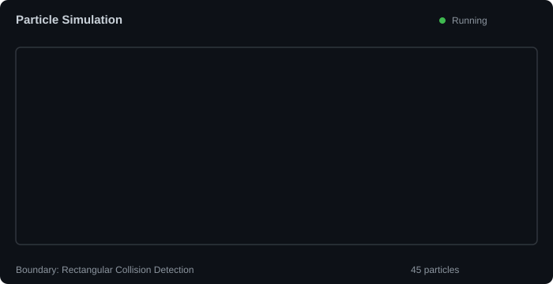

<h1 align="center">Hi 👋, I'm Zaid</h1>
<h3 align="center">"AI as a reflection of its creators."</h3>

  

🤖 Currently building AI applications and exploring AGI

🚀 Interested in Artificial Intelligence, Machine Learning, LLMs, and Agentic AI

🌱 Continuously learning through hands-on projects and open-source contributions

<h3 align="left">Connect with me:</h3>

<h3 align="left">AI & Development Stack:</h3>

  

  

  

  

  

  

  

  

  

  

  

  

## Resources

- [Facebook CV Design Booking Agent Plan](./FACEBOOK_CV_AGENT_PLAN.md)
